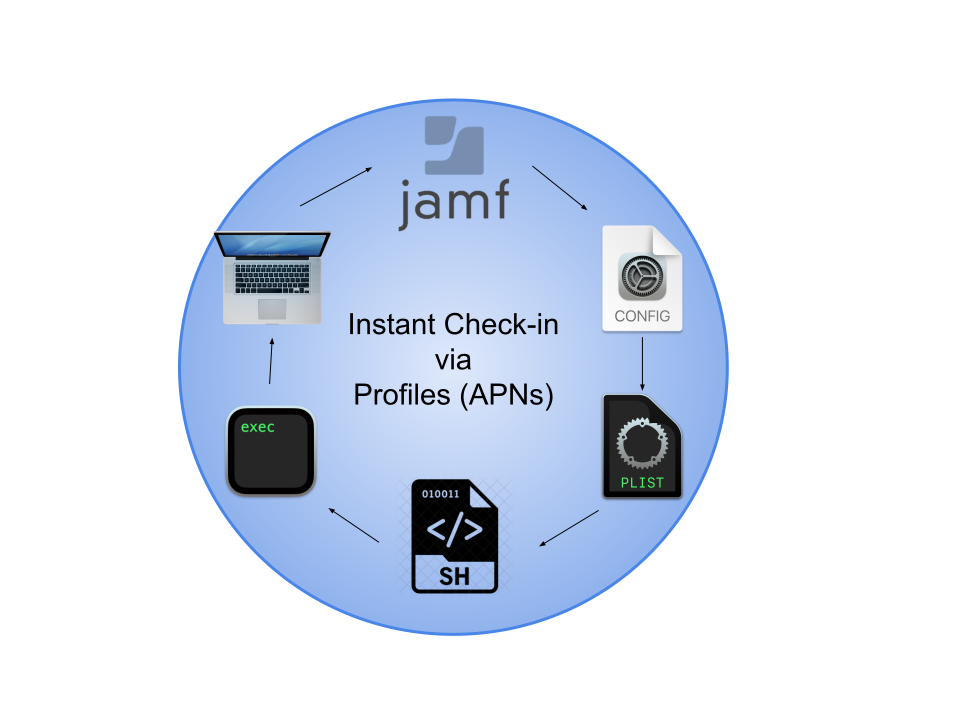
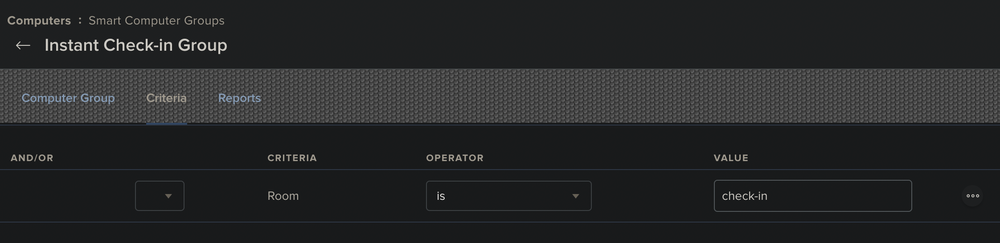
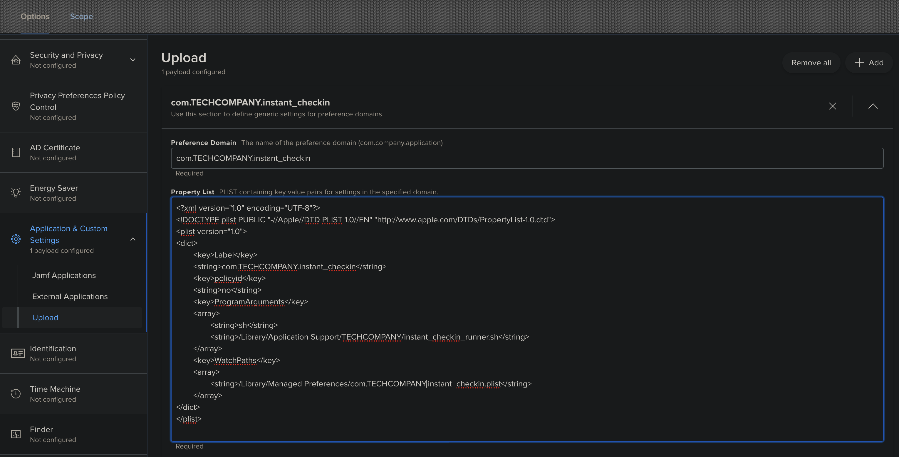
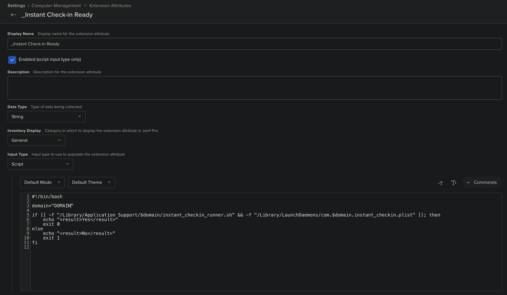
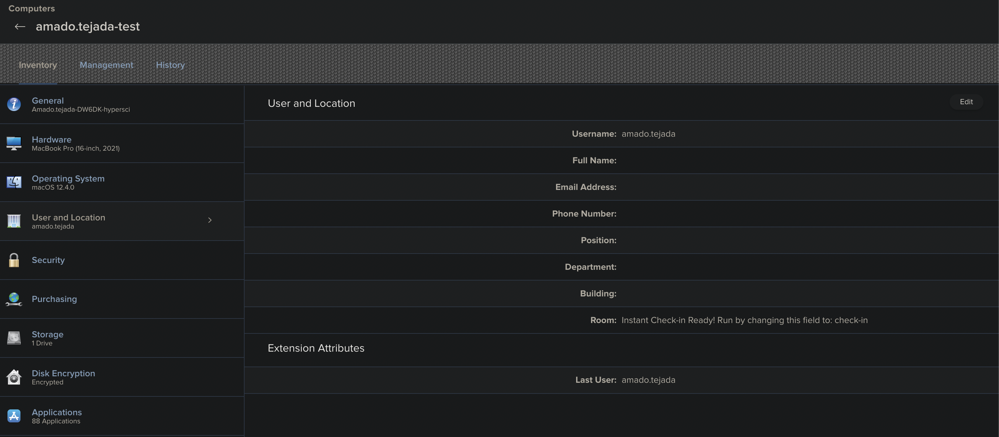

# instant-checkin
##### Written by [Amado Tejada](https://www.linkedin.com/in/amadotejada/)
##

MDM solutions like Jamf, AirWatch and many others have computers check-in at a cadence, usually every 15/30 minutes with no way to force a computer to check in instantly to get new policies/software unless you have the computer's owner manually check in, or you have the computer with you. SSH is not a reliable option with many working from home with their own network set up.

With companies going to a working remote workforce, this may pose a security risk for administrators who may need to push an urgent remediation to computers that are vulnerable to a malicious attack or need to deploy software urgently. Depending on your company's security policy, 15 minutes before a machine acts is unacceptable. Especially if you do not have an EDR solution in your stack.

*instant-checkin* is an MDM workaround to force computers to check in instantly via an MDM profile (APNs).

 

## Note
-  Only tested with Jamf Pro
    * Other MDM solutions may work, but have not been tested
-  Uses an attribute from `User and Location`

## Files Prep
1. Open `instant_checkin_deploy.sh` and `instant_checkin_attribute.sh`
    * edit `$DOMAIN` to your Jamf Pro server's domain
2. Open `com.DOMAIN.instant_checkin.plist`
    * edit `DOMAIN` to the same domain as in step 2
    * change the DOMAIN in the file title

## Jamf Pro Setup
1. Create a smart computer group
    * set criteria to `Room` is `check-in`
    
2. Create a MDM profile
    * set the scope to the computer group in step 1
    * upload the `com.DOMAIN.instant_checkin.plist` profile
    
3. Create a custom user attribute
    * Settings > Computer Management >  Extension Attributes
    * copy content `com.DOMAIN.instant_checkin.plist`
    
4. Upload the `instant_checkin_deploy.sh` script Jamf Pro server
    * Settings > Computer Management > Scripts
5. Create a new Jamf Pro policy
    * include the `instant_checkin_deploy.sh` script
    * scope the computers you want to use *instant-checkin* to

## Usage
*instant-checkin* works by using an attribute from `User and Location` as the trigger to force a computer to check in.

For my use I use the `Room` which we do not use. 

<!--   -->
1. When you wish to force a check-in on a computer, edit the `Room` field to `check-in` and save.
    * That will push the profile from step 2 to the computer instantly via APNs
    * The profile will trigger `instant_checkin_deploy.sh` to run on the computer
    * `instant_checkin_deploy.sh` will run any new policies assigned to the computer and check-in
    * `Room` also resets to be triggered again at a later time.

If you want to force a specific policy, you can add the ID to `com.DOMAIN.instant_checkin.plist` below `policyid`

## *instant-checkin CLI*
I also created a python CLI tool to force check-ins via terminal

[*instant-checkin CLI*](https://github.com/amadotejada/instant-checkin-cli)

<!--  -->

### License

*instant-checkin* is released under the [MIT License](https://github.com/amadotejada/instant-checkin/blob/main/LICENSE)
